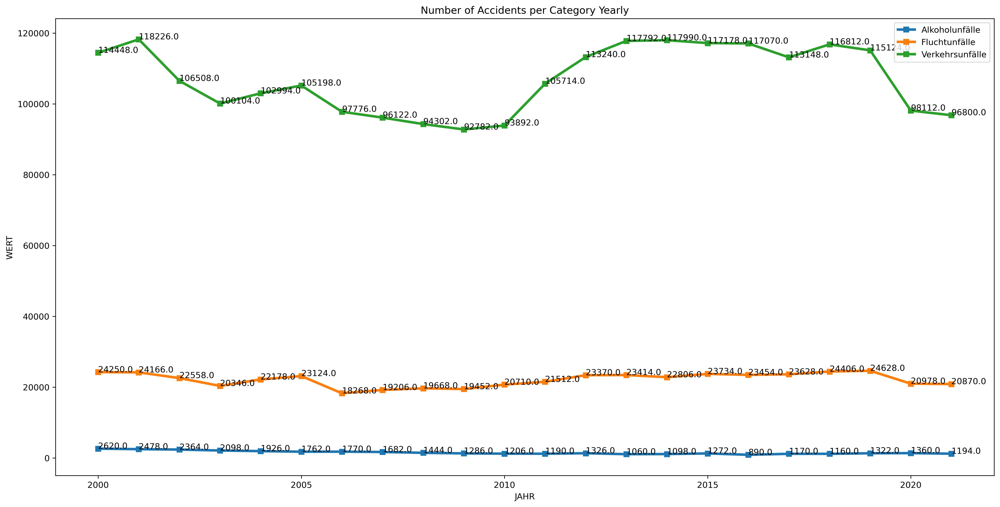

# Project Title: Number of Accidents Prediction 

## Description

The “Monatszahlen Verkehrsunfälle” Dataset from the [München Open Data Portal](https://www.opengov-muenchen.de/dataset/monatszahlen-verkehrsunfaelle/resource/40094bd6-f82d-4979-949b-26c8dc00b9a7) is used. 

Here we see the number of accidents for specific categories per month. Important are the first 5 columns:

- Category
- Accident-type (insgesamt means total for all subcategories)
- Year
- Month
- Value

A visualization of the number of accidents per category historically is shown below:



**The Project is Deployed using Heroku.**

To get a prediction, make a POST request to: 

https://accident-model.herokuapp.com/predict

The body of the request should be JSON format like below:
```
{
    "Category": ,
    "Type": ,
    "Year": ,
    "Month":
}
```

